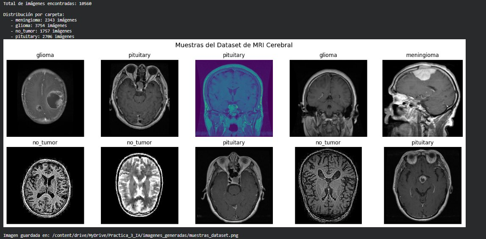
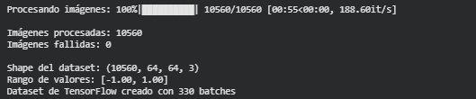
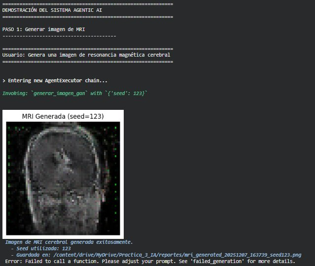

# 🧠 CerebraIA

> **IA generativa para el apoyo al diagnóstico temprano de tumores cerebrales mediante síntesis y análisis de imágenes de resonancia magnética.**

En Colombia, el acceso a diagnóstico especializado por imágenes es limitado y desigual. **CerebraIA** combina redes generativas adversariales, modelos de lenguaje multimodal y agentes autónomos para generar imágenes sintéticas de MRI cerebral, analizarlas y producir reportes médicos estructurados — acercando tecnología de punta a quienes más la necesitan.

>Las imágenes generadas son sintéticas y tienen fines educativos. Este sistema no reemplaza el diagnóstico médico profesional.

---

## ✨ Capacidades principales

| Capacidad | Tecnología |
|-----------|-----------|
| Generación de imágenes MRI sintéticas | DCGAN (TensorFlow) |
| Análisis radiológico visual | Gemini 2.5 Flash (multimodal) |
| Evaluación diagnóstica | LLaMA 3.1 vía Groq |
| Orquestación autónoma de tareas | LangChain Agents |
| Trazabilidad de decisiones | AgentLogger (JSON) |

---

## 🖼️ Sistema en acción

### Dataset — 10 560 imágenes de MRI clasificadas en 4 categorías
*glioma · meningioma · pituitary · no_tumor*



### Preprocesamiento — 330 batches listos para entrenar la GAN



### Demo del agente — generación, análisis y diagnóstico en lenguaje natural



---

## 🏗️ Arquitectura

```
Usuario (lenguaje natural)
        │
        ▼
 AgentExecutor (LangChain)
        │
        ├── generar_imagen_gan     →  DCGAN Generator (TensorFlow)
        ├── analizar_imagen_llm    →  Gemini 2.5 Flash (visión multimodal)
        ├── diagnostico_tumor_llm  →  LLaMA 3.1 · Groq
        ├── comparar_imagenes      →  DCGAN × N muestras
        └── generar_reporte_medico →  LLaMA 3.1 · Groq
                │
                ▼
        AgentLogger → trazabilidad completa en JSON
```

### DCGAN — Generador (4×4 → 64×64)

```
Ruido (100,) → Dense → 4×4×512
→ Conv2DTranspose(256) → 8×8
→ Conv2DTranspose(128) → 16×16
→ Conv2DTranspose(64)  → 32×32
→ Conv2DTranspose(3, tanh) → 64×64×3
```

---

## 🚀 Inicio rápido

> Recomendado: **Google Colab** con GPU T4 o superior.

### 1. Instalar dependencias

```bash
pip install -r requirements.txt
```

### 2. Entrenar la GAN

```python
from src.data import setup_kaggle, download_dataset, find_images, preprocess_images, build_tf_dataset
from src.gan  import DCGAN, GANCallback, train_gan

setup_kaggle("TU_USUARIO_KAGGLE", "TU_API_KEY")
download_dataset("/content/dataset")

images  = find_images("/content/dataset")
X_train = preprocess_images(images)
dataset = build_tf_dataset(X_train)

gan      = DCGAN(latent_dim=100)
callback = GANCallback(gan, save_path="/content/outputs", save_interval=10)
history  = train_gan(gan, dataset, epochs=200, callback=callback, models_path="/content/models")

gan.generator.save("/content/models/generator_final.keras")
```

### 3. Lanzar el agente

```python
from src.agent import init_llms, init_generator, build_agent, AgentLogger, chat_with_agent, LLM_GROQ

init_llms(google_api_key="...", groq_api_key="...")
init_generator("/content/models/generator_final.keras", latent_dim=100)

agent  = build_agent(LLM_GROQ)
logger = AgentLogger()

chat_with_agent(agent, logger, "Genera una imagen de MRI cerebral")
chat_with_agent(agent, logger, "Analízala y dame un diagnóstico para un paciente de 52 años con cefaleas intensas")
```

---

## 📁 Estructura del repositorio

```
CerebraIA/
├── src/
│   ├── gan.py           # Arquitectura DCGAN y bucle de entrenamiento
│   ├── data.py          # Carga, exploración y preprocesamiento del dataset
│   ├── agent.py         # Tools LangChain, agente autónomo y logger
│   └── __init__.py
├── notebooks/
│   └── proyecto_ia.py   # Código completo ejecutable en Google Colab
├── docs/
│   ├── architecture.md  # Descripción detallada de la arquitectura
│   └── images/          # Capturas del sistema en funcionamiento
├── requirements.txt
├── .gitignore
└── README.md
```

---

## ⚙️ Requisitos

- Python 3.10+
- Google Colab (GPU T4 recomendada)
- Cuenta en [Kaggle](https://www.kaggle.com) para el dataset
- API keys: [Google AI Studio](https://aistudio.google.com) y [Groq](https://console.groq.com)

### Secrets en Google Colab

| Secret | Descripción |
|--------|-------------|
| `GOOGLE_API_KEY` | API key de Gemini (Google AI Studio) |
| `GROQ_API_KEY` | API key de Groq |

---

## 📊 Dataset

[Brain Tumor MRI Dataset — Kaggle (ishans24)](https://www.kaggle.com/datasets/ishans24/brain-tumor-dataset)

10 560 imágenes de resonancia magnética cerebral distribuidas en 4 clases:

| Clase | Imágenes |
|-------|----------|
| Glioma | 3 754 |
| Meningioma | 2 343 |
| Pituitary | 2 706 |
| No tumor | 1 757 |

---

## 👤 Autor

**Daniel Garzón** — [@Dgarzonac9](https://github.com/Dgarzonac9)
